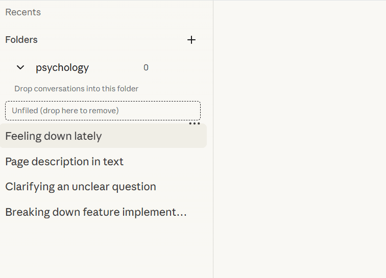

<div align="center">


# claude-nexus

### Claude 缺失的增强套件 ✨

为 [claude.ai](https://claude.ai) 带来文件夹管理、时间线导航、提示词库等强大功能。

[](#安装)
[](../LICENSE)
[](https://react.dev)
[](https://www.typescriptlang.org)

[English](../README.md) · [中文](#)

</div>

---

> 我每天都在用 Claude。但随着对话越来越多，侧边栏会变得越来越乱：不能分组，也很难快速找到需要的内容。
>
> 有一天我看到了 [gemini-voyager](https://github.com/Nagi-ovo/gemini-voyager) 这个项目，被它的思路打动了。我在想：为什么 Claude 没有类似的增强套件？
>
> 所以我做了 claude-nexus。

## ✨ 功能

### 📂 对话文件夹管理

**让你的对话井井有条。**
通过拖拽将对话整理到文件夹中，告别杂乱的历史记录列表。

- **拖拽操作**：轻松将对话移入文件夹
- **便捷管理**：随时重命名、删除和重新整理
- **持久化存储**：文件夹结构跨会话本地保存




### 📍 时间线导航

**再也不会在长对话中迷失。**
可视化节点让你一眼看清对话结构，点击即可跳转到任意消息。右侧固定时间线导航，点击节点快速跳转到对应消息，悬浮显示消息预览。


### 🫧 悬浮球 + 📐 对话宽度调整

**常用能力快速入口。**
悬浮球可拖拽到任意位置，通过面板提供常用操作入口，包括对话宽度调整（38–90rem，默认 48rem）。


### 💡 提示词库

**你的个人提示词武器库。**
支持提示词保存、搜索、编辑与一键插入到输入框工具栏。


### 💾 对话导出

**你的数据，你做主。**
在对话页面工具栏一键导出对话内容，支持 Markdown / JSON。


---

## 📥 安装

### 手动安装（开发版）

1. 克隆仓库

   ```bash
   git clone https://github.com/qiuner/claude-nexus.git
   cd claude-nexus
   ```

2. 安装依赖

   ```bash
   yarn install
   ```

3. 构建扩展

   ```bash
   yarn build:chrome
   ```

4. 在 Chrome 中加载
   - 打开 `chrome://extensions`
   - 开启**开发者模式**
   - 点击**加载已解压的扩展程序**
   - 选择 `dist/` 文件夹

---

## 🛠️ 开发

```bash
# 启动开发模式（自动重新构建）
yarn dev:chrome

# 每次构建后：
# 1. 打开 chrome://extensions
# 2. 点击 claude-nexus 的刷新按钮
# 3. 刷新 claude.ai 页面
```

---

## 🤝 贡献

欢迎提交 Issue 和 Pull Request！

1. Fork 本仓库
2. 创建功能分支 (`git checkout -b feat/amazing-feature`)
3. 提交更改 (`git commit -m 'feat: add amazing feature'`)
4. 推送分支 (`git push origin feat/amazing-feature`)
5. 发起 Pull Request

---

## 🌟 致谢

灵感来源于 [gemini-voyager](https://github.com/Nagi-ovo/gemini-voyager) —— 一个为 Google Gemini 打造的全能增强套件。

---

## 📄 许可证

MIT License © 2026 Qiuner

<div align="center">
为 Claude 用户用心打造 ❤️
</div>
