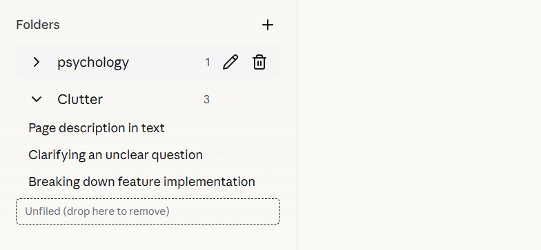
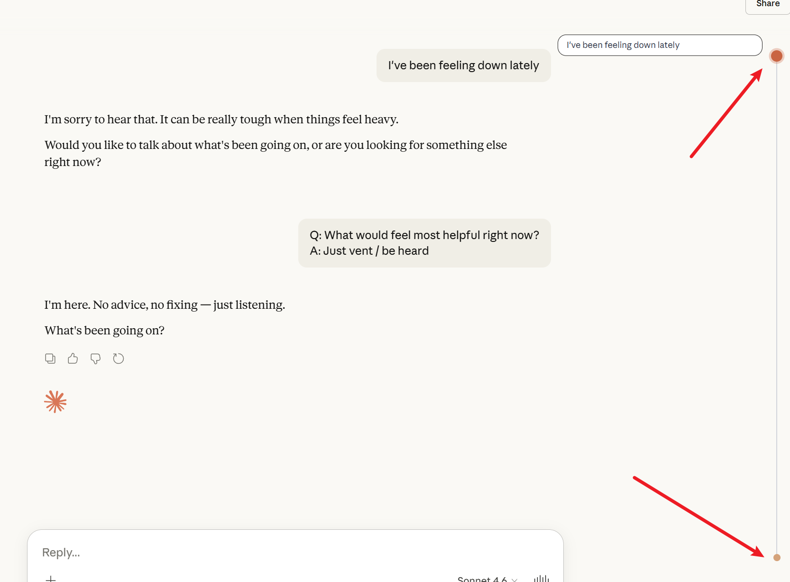

<div align="center">


# claude-nexus

### The missing power-up for Claude ✨

Supercharge your [claude.ai](https://claude.ai) experience with folder organization, timeline navigation, prompt library, and more.

[](#installation)
[](LICENSE)
[](https://react.dev)
[](https://www.typescriptlang.org)

[English](#) · [中文](.github/README_ZH.md)

</div>

---

## ✨ Features

### 📂 Folder Organization

**Keep your conversations sorted.**
Drag and drop your chats into folders that make sense to you. Stop digging through a cluttered history list.

- **Drag & drop**: Move conversations into folders effortlessly
- **Easy management**: Rename, delete, and reorganize at any time
- **Persistent storage**: Your folder structure is saved locally across sessions




### 📍 Timeline Navigation

**Never get lost in a long conversation again.**
Visual nodes let you see the structure of your chat at a glance and jump to any message instantly. Fixed on the right; click to jump and hover to preview messages.



### 💡 Prompt Library _(coming soon)_

**Your personal prompt arsenal.**
Save your best prompts and reuse them without retyping.

### 💾 Chat Export _(coming soon)_

**Your data, your format.**
Export conversations as Markdown or JSON.

---

## 📥 Installation

### Manual Installation (Development)

1. Clone the repository

   ```bash
   git clone https://github.com/your-username/claude-nexus.git
   cd claude-nexus
   ```

2. Install dependencies

   ```bash
   yarn install
   ```

3. Build the extension

   ```bash
   yarn build:chrome
   ```

4. Load in Chrome
   - Open `chrome://extensions`
   - Enable **Developer mode**
   - Click **Load unpacked**
   - Select the `dist/` folder

---

## 🛠️ Development

```bash
# Start development mode with auto-rebuild
yarn dev:chrome

# After each build:
# 1. Open chrome://extensions
# 2. Click the refresh button on claude-nexus
# 3. Refresh the claude.ai page
```

### Tech Stack

- **Framework**: React 19 + TypeScript
- **Styling**: TailwindCSS 4
- **Build**: Vite + vite-web-extension
- **Platform**: Chrome Manifest V3

---

## 🤝 Contributing

Contributions are welcome! Feel free to open issues or submit pull requests.

1. Fork the repository
2. Create your feature branch (`git checkout -b feat/amazing-feature`)
3. Commit your changes (`git commit -m 'feat: add amazing feature'`)
4. Push to the branch (`git push origin feat/amazing-feature`)
5. Open a Pull Request

---

## 🌟 Credits

Inspired by [gemini-voyager](https://github.com/Nagi-ovo/gemini-voyager) — an all-in-one enhancement suite for Google Gemini.

---

## 📄 License

MIT License © 2026

<div align="center">
Made with ❤️ for Claude users
</div>
